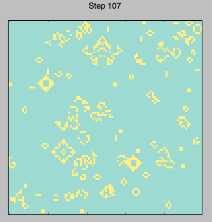

Game Of Life (pyLife)
=====================

This is my implementation of [Conway's Game of Life](http://en.wikipedia.org/wiki/Conway's_Game_of_Life) in Python. There are variations of this available on the Internet, and I wanted to create my version.

Two files are included:
- LaunchLife.py: This is the main file where you can set various parameters and launch Life.
- life.py: This files defines the class Life.

#### General Overview
My implementation uses Numpy, Scipy and Matplotlib. The Life grid is updated on a 2D plot using Matplotlib.
The patterns used on the grid are read from [pattern files in text format](http://conwaylife.com/wiki/Plaintext).

You can initialise the grid using a pattern by specifying its name and (x,y) location as the seedType parameter.

    # generate an acorn pattern at x=20, y=40
    'seedType': ('acorn', (20, 40))

Alternatively, you can specify the parameter 'mixed pattern' with a tuple containing the number of random patterns to generate.

    # generate 7 random patterns.
    'seedType': ('mixed pattern', (7,))

Finally, you can populate the grid with random live cells as so:

    # populate the grid with 3000 live cells
    'seedType': ('random', (3000,))

Omitting the `seedType` parameters results in a randomly generated grid.

#### Parameters
You can pass various parameters to control the Life grid. These can be expanded further to create a flexible simulation environment.

The parameters available so far are:
- rows: number of rows in the grid
- cols: number of columns in the grid
- steps: number of steps in the simulation
- seedType: select from various grid initial states
- refreshInterval: animation refresh rate (in miliseconds)
- colourmap: choice of matplotlib colourmaps

